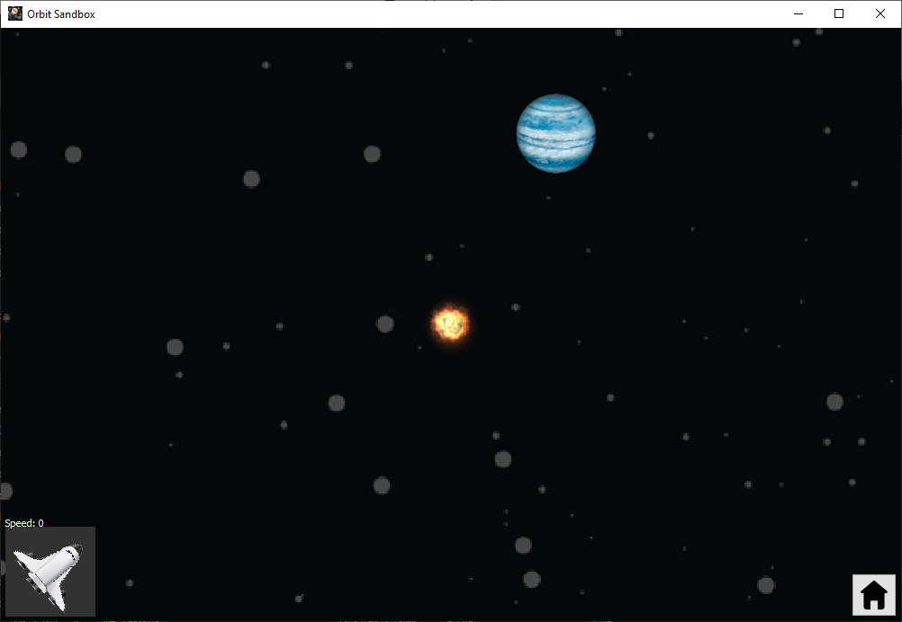

# orbit-sandbox
# orbit-sandbox #
## About ##
A simple game built around the force of gravity acting on celestial bodies in space. Written in C++ using the Qt framework.

## Learning Outcomes ##

The main learning objective of this project was to improve and build confidence in my C++ skills, as well as to experiment with some basic physics in a simulation in space. By engaging in a decently sized project and by utilising tools such as Valgrind, I gained a great deal of experience and understanding of C++ and the very popular Qt framework, skills that are likely to be extremely valuable in the future. In addition, I enjoyed learning about the fascinating physics required to create a simulation in space, for example calculating the gravitational pull exerted from one celestial body on another, and calculating the required velocity for a body to be placed in orbit of another. 

After my final year project I wanted to put more focus on improving the usability of this project. I therefore put more work into creating an intuitive user interface with as little text as possible, with the aim of having users be able to jump into the game and instantly understand the controls and purpose of the game mode. All of the sprites used in the game are easily recognisable objects that stand out from the background and behave just as the player expects them to (perhaps with the exception of the white dwarf, which is the size of a planet but is so dense that it has the mass and gravitational pull of a star). 

In Exploration mode, since the rocket is fixed in the centre of the screen, controlling the rocket gives instant feedback to the player as they are able to see the background move. As the rocket accelerates, the background moves more quickly, and the movement of the background shows which direction the rocket is moving in in relation to a fixed reference point. In Sandbox mode, a lot of time was spent perfecting the camera controls and making them feel accurate, responsive and intuitive. Overall I feel that the extra attention I put into usability has paid off, and I am proud of the intuitive controls and aesthetic of the game.

As the game became more complex and once procedural generation of planetary systems was implemented, the number of bodies that could be present in the simulation at any one time rapidly increased into the low thousands. Optimisation of the simulation became increasingly important since performance was initially severely lacking with this number of bodies. I kept track of how many ticks were being performed each second and used this metric to experiment with and determine the effects of different optimisations. A number of general optimisations were found to improve the performance a fair amount, such as allocating memory before a loop rather than reallocating the memory inside every loop.

One important consideration for optimisation was the level of accuracy for collision detection. For the most accurate results I check whether the sprites for the two bodies in question are overlapping, and if so they are considered to be colliding. This is a relatively costly process, so a number of checks were added in order to only use this method when necessary. First, the Manhattan distance between the bodies is calculated and the collision detection process only continues if the bodies are found to be somewhat close to each other. If so, the bounding rectangles of the bodies are then checked to find if they overlap. In most cases, for example when the simulation is zoomed out very far or if the bodies are off screen, the level of accuracy of this method is good enough as the player is unlikely to be able to notice the difference. Only if one of the bodies is on screen and when the level of zoom is greater than a certain value are the sprites checked for any overlaps. 

A similar consideration is applied when calculating the gravitation pull exerted from one body on another. Since the calculation is quite costly and involves a square root function, I wanted to minimise the number of times the force needed to be calculated in the O(n^2) main loop. I run two checks that avoid the calculation if the result would be very close to zero. First, the Manhattan distance between the bodies is calculated to ensure that the bodies are relatively close to each other. Second, the ratio of the masses of the bodies must not be close to zero, because a tiny asteroid will have a negligible gravitational pull on a nearby star. 

The largest optimisation was the parallelisation of the main loop in the simulation. Before this change I noticed that the simulation would cause one CPU core to be maxed out, thus hurting the performance of the game. A significant performance improvement was seen after spreading the workload over several threads to make much better use of multi-core and multi-threaded processors. 

Experimenting with these optimisations has provided me with experience to improve my overall code quality by utilising the optimisation techniques discovered.

## Tour of the Software ##

There are currently two game modes available: Sandbox mode and Exploration mode.

In Sandbox mode the player has the ability to spawn a number of celestial bodies using the panel on the right of the screen. 

Once a type of body has been chosen, click and drag on the screen to spawn it. The further the mouse is dragged, the greater the body's velocity as it spawns.

Spawn many bodies at once by selecting the 'Planetary System' body type. This spawns a large celestial body (randomly chosen between a star, white dwarf or black hole) and then a number of planets in orbit around this central body, and in turn spawns asteroids in orbit around those planets. Observe the bodies orbit around each other and combine together when they collide. Zoom in or out by using the scroll wheel, and move the camera around by holding right click or the middle mouse button and dragging the mouse.

In Exploration mode the player controls a rocket placed in the centre of the screen. The rocket is initially spawned orbiting a planet within a planetary system. 

Press and hold W to fire the rocket's engines and increase its velocity in the direction it is currently facing. Use the A and D keys to rotate the rocket anti-clockwise and clockwise respectively. The panel in the bottom left of the screen shows the rocket's speed, angle and direction of travel. 

As the rocket moves around, planetary systems are procedurally generated to provide an endless universe to explore.

But try not to crash or the game will end!

A recap of the game modes and the controls available in each can be found in the controls screen.
